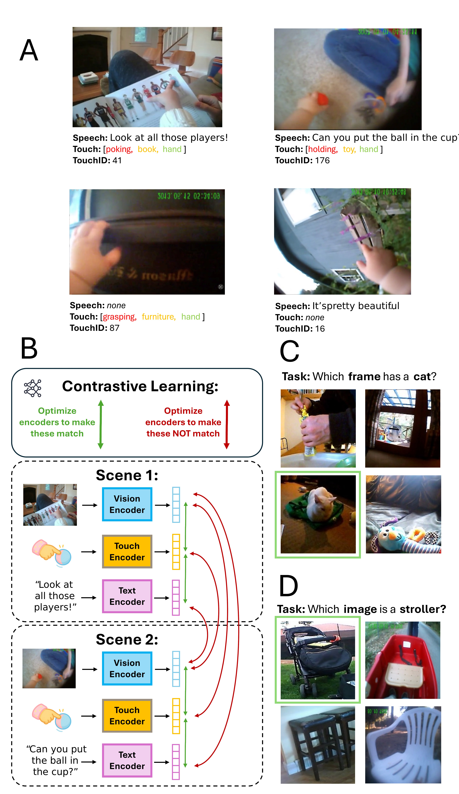
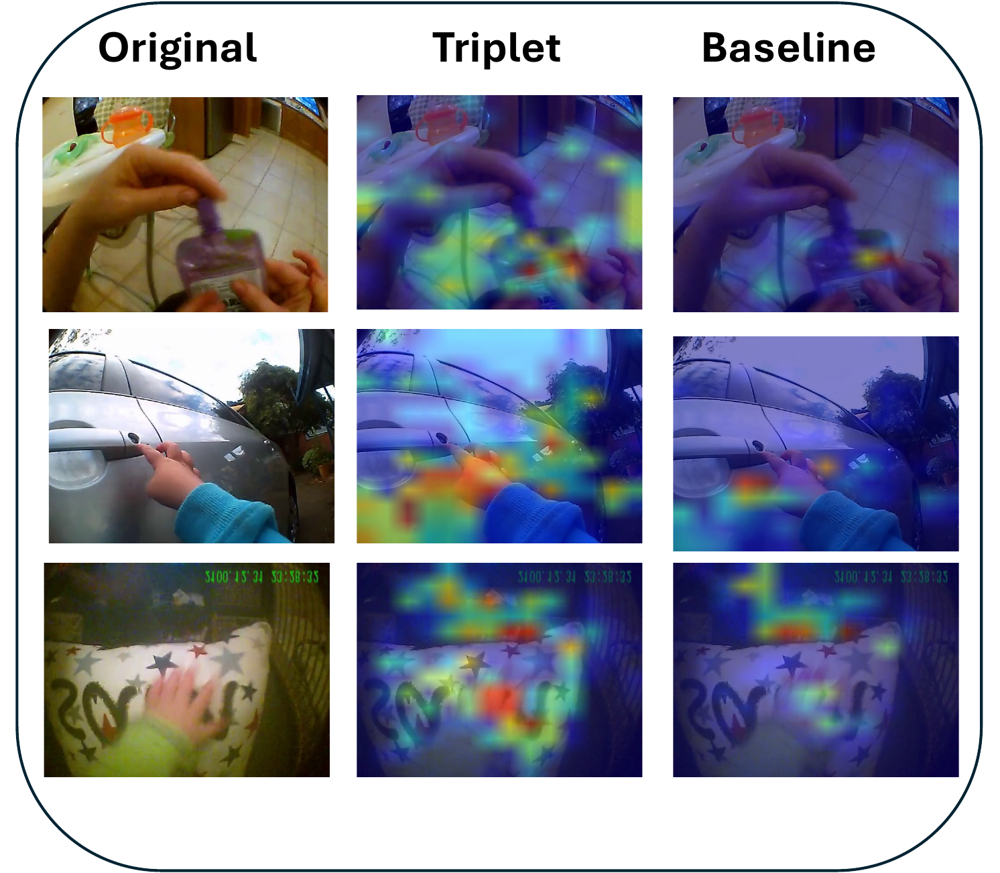

# Contrastive Learning from Vision-Text Cluster Triplets
This repo contains the code from TODO.



**A)** *Examples of [`frame, speech transcript, touch ID`] triplets (top) and data
pairs missing either speech or touch (bottom). **B)** Visualization of model
architecture and contrastive learning. **C)** Labeled-S test sample.
**D)** PV test sample.*


## Setup

Create the conda environment from `environment.yml` (env name `touch`):

```bash
conda env create -f environment.yml
conda activate touch
```

## Data
### To use our data:
Download clips, jsons, labeled-s, and pv folders from (Databrary link TODO), and place them in data/clips, data/jsons, data/labeled-s, and data/pv.

### To use your own:

## Preprocessing
These steps can be skipped if using our prepared data.
### Filtering
The `data_filtering/` folder contains scripts for scoring and filtering image-caption pairs before training. Supports BLIP, OpenCLIP, SigLIP, and Qwen models. See `data_filtering/README.md` for usage.

### Clustering
Set path and CLUSTER_NUMBERS in run_k_means.py, then run this file. Note that larger k values in CLUSTER_NUMBERS take a very long time to run.

## Training
See `scripts/triplet_run.sh` and 'scripts/speech/only_run.sh' for full examples with all hyperparameters.



## Evaluation
This repo supports eval on Labeled-S and Picture Vocabulary. See eval/README.md for details on eval/eval.py configurations.


## Structure

```
├── train.py              # main training script
├── run.sh                # example training command
├── data_filtering/       # scripts for filtering image-caption pairs
└── multimodal/           # model and data module code (submodule)
```


## Acknowledgment

This project builds on code from https://github.com/wkvong/multimodal-baby
